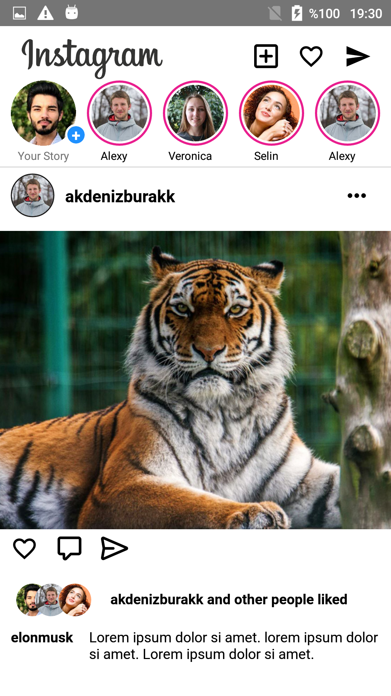
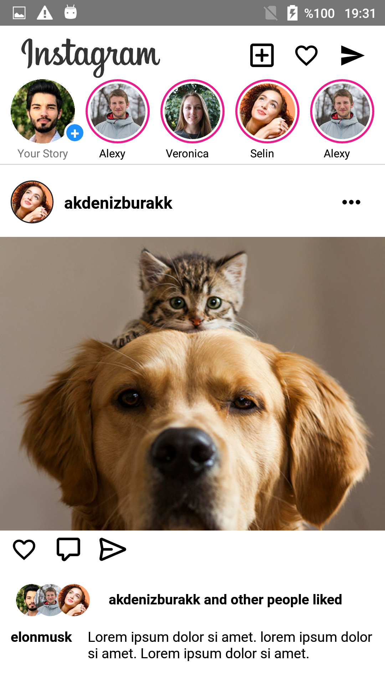
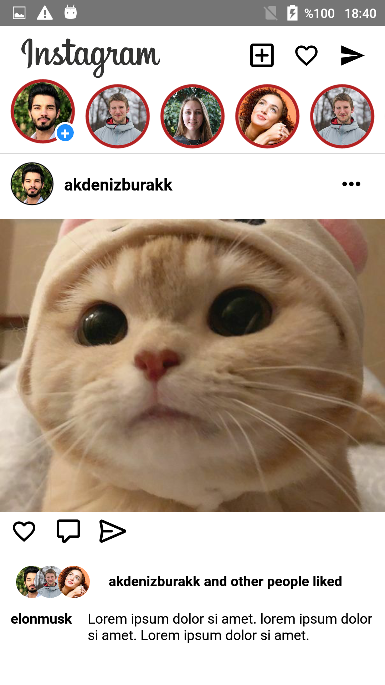
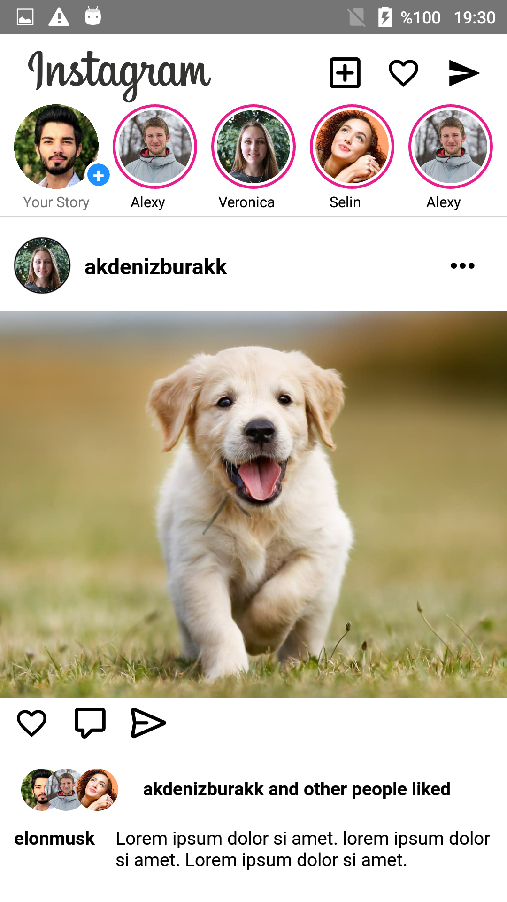

# Homework 1 
### This is a simple Instragram Mobile Application clone. It cludes only component, images and text. Non pressable and non redirecting another page.

# Used Library
* react-native-vector-icons /Octicons/MaterialIcons

## HomePage

     
     

* Insragram logo and other buttons
* Horizontal scrollview for Stories

* Post Banner pp and nickname and options button
* Post content
* Post action buttons

* Liked's rofile pictures
* Liked's names

* Comment's write nickname
* Comments

##### This is 1.Week Homework at Akbank & Patika.dev React Native Bootcamp's.
